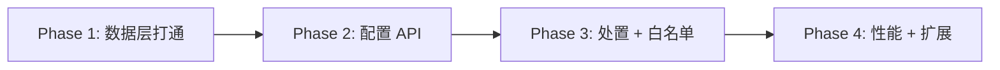
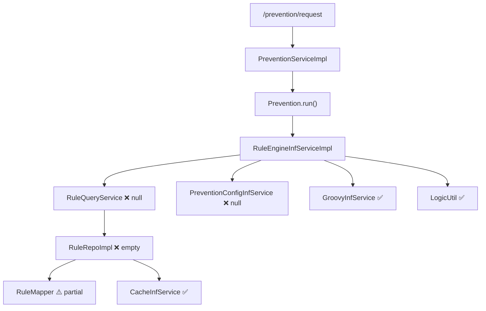

# 项目现状与规划

> 评估时间：2026-06-13  
> 项目定位：简易风控引擎（Spring Boot 2.0 + MySQL + Redis + Groovy 脚本 + JEXL 逻辑组合）

## 总体结论

**架构和领域模型已经搭得比较完整，但「配置 → 持久化 → 运行态读取 → 处置输出」这条主链路还没打通。**

整体完成度约 **40%**，更像一个**设计验证原型**，而不是可上线的引擎。

> 领域设计和规则执行内核已经搭好，但持久化、配置管理、运行态读配置这三块是空壳，主链路未闭环。

---

## 一、现在已经有什么

### 1. 架构骨架（较完整）

多模块划分清晰：

| 模块 | 职责 |
|------|------|
| `blazkowicz-running` | 运行态：防控请求、规则执行 |
| `blazkowicz-configuration` | 配置态：Event / Strategy / Rule |
| `blazkowicz-domain-share` | 共享领域模型 |
| `blazkowicz-infrastructure-share` | 共享基础设施（DB、Redis、Repo） |

领域模型设计也比较到位：

- 聚合根：`Prevention`、`Event`
- 实体：`Strategy`、`StrategyPack`、`Rule`
- 设计原则：**规则与策略分离**（规则只管脚本，策略决定参数和处置）

### 2. 规则引擎核心（局部可用）

以下组件在单测里是能跑通的：

| 组件 | 路径 | 作用 |
|------|------|------|
| `GroovyInfService` | `running-infrastructure` | Groovy 脚本编译、缓存、执行 |
| `LogicUtil` | `blazkowicz-common` | JEXL 做条件逻辑组合 |
| `RuleEngineInfServiceImpl` | `running-infrastructure` | 遍历条件脚本 → 替换 logic → 输出 `MEET / NOT_MEET / ERROR` |

执行流程：

1. 对每个 `Condition` 执行 Groovy 脚本，得到 true/false
2. 将 logic 字符串中的 conditionId 替换为结果
3. 用 JEXL 计算最终布尔值

### 3. 运行态入口（有壳，缺数据）

目前只有一个 HTTP 接口：

```
GET /prevention/request?prevention_type=TEST&business_identity=TEST&user_id=114515
```

调用链：

```
PreventionController
  → PreventionServiceImpl
    → Prevention.run()
      → RuleEngineInfService.getRunningStrategyList()
      → RuleEngineInfService.run()
```

### 4. 基础设施（部分完成）

| 能力 | 状态 |
|------|------|
| MySQL + MyBatis | Sequence 发号、`RuleMapper` 有 SQL 定义 |
| Redis | `CacheInfService` 可用（有单测） |
| 规则配置应用层 | `RuleConfigurationServiceImpl` 创建/更新逻辑已写 |
| Sequence ID | `SequenceInfServiceImpl` 已实现 |

### 5. 测试覆盖

| 测试 | 覆盖内容 |
|------|----------|
| `GroovyInfServiceTest` | Groovy 脚本执行 |
| `LogicUtilTest` / `TestLogic` | JEXL 逻辑计算 |
| `CacheInfServiceTest` | Redis 读写 |
| `MapperTest` | DB 连接、Sequence 发号 |

---

## 二、关键断点（为什么现在还跑不通）

运行态最终会卡在 **`RuleQueryService.getRuleRespList()` 返回 `null`**，后续还会 NPE。

配置态 **`RuleRepoImpl` 三个方法全是 todo**，规则实际上存不进去也读不出来。

### 空实现 / 未完成模块

| 模块 | 文件 | 状态 | 影响 |
|------|------|------|------|
| 规则查询 | `RuleQueryService` | 返回 null | 运行态拿不到规则 |
| 规则仓储 | `RuleRepoImpl` | 空实现 | 规则无法持久化 |
| 策略仓储 | `StrategyRepoImpl` | 空实现 | 策略无法管理 |
| 策略 Mapper | `StrategyMapper` | 空接口 | 策略表无 CRUD |
| 防控配置 | `PreventionConfigInfService` | 空实现 | 处置配置缺失 |
| 处置响应 | `DisposalResp` | 空类 | 处置结果无法表达 |
| Event 持久化 | `Event.save()` | todo | Event 聚合根无法落库 |
| 配置服务 | `EventConfigurationService` | 空接口 | 无 Event 配置 API |
| 配置服务 | `StrategyConfigurationService` | 空接口 | 无 Strategy 配置 API |
| 配置 Controller | — | 不存在 | 只能通过代码/DB 手工配 |
| 处置逻辑 | `Prevention.run()` | todo | 只返回命中状态，无真正处置 |
| Prevention 创建 | `PreventionServiceImpl` | todo | 工厂/创建逻辑未完善 |

**结论：引擎「算」的能力有了，但「配」和「存」几乎没接上。**

---

## 三、README 待办清单（按优先级归类）

### P0 — 先打通最小闭环（MVP）

**目标**：本地能配一条规则 → 调 `/prevention/request` → 返回正确识别结果。

- [ ] 补全 `RuleRepoImpl`（对接 `RuleMapper` + Redis 缓存）
- [ ] 补全 `RuleQueryService`（按 `businessIdentity + preventionType` 查规则）
- [ ] 补全 `PreventionConfigInfService` + `DisposalResp`（至少能返回默认处置）
- [ ] 补 `StrategyRepoImpl` + `StrategyMapper`（策略绑定规则）
- [ ] 完善 `Prevention.run()` 的处置逻辑
- [ ] 补数据库建表 SQL（`tb_blazkowicz_rule`、strategy 相关表；README 目前只有 sequence 表）

### P1 — 配置态可用

**目标**：不直接改 DB，也能管理规则和策略。

- [ ] 实现 `EventConfigurationService` / `StrategyConfigurationService`
- [ ] 增加配置 Controller（规则 CRUD、策略 CRUD）
- [ ] `Event.save()` 持久化
- [ ] 明确 Strategy 与 Rule 的修改边界（公共 Rule 可改，Strategy 里不能改 Rule 脚本，只能引用 + 配参数）

### P2 — 引擎能力增强

- [ ] 加白（白名单跳过）
- [ ] 并发处理
- [ ] 配置态热更新（改规则后运行态生效）
- [ ] 内存缓存（Redis 已接，但 Rule 查询还没用上）
- [ ] 规则/策略搜索

### P3 — 扩展与生产化

- [ ] Dubbo 接入
- [ ] NoSQL
- [ ] 多种规则类型（黑白名单库等，不只是 Groovy 脚本）
- [ ] 技术债：Spring Boot 2.0.1、fastjson 1.2.83 等版本偏旧

### 已完成项（README 中已划线）

- Prevention 实体
- ConfigurationRule 的构造方法
- 传左参数
- 聚合根等注解
- 规则参数和策略分开
- Strategy 引入规则，同时更新 rule 参数
- rule 中重写，只有脚本，没有参数，但会对外展示需要什么参数
- rule 是否要用 id 概念
- 接入缓存
- 日志配置

---

## 四、建议推进路线图



### Phase 1 — 数据层打通（预估 1–2 周）

1. 建表 + 补 Repo 实现
2. 写一条 TEST 规则 seed 数据
3. 跑通 `/prevention/request` 端到端

**核心文件：**

- `RuleRepoImpl`
- `RuleQueryService`
- `PreventionConfigInfService`
- `StrategyRepoImpl` / `StrategyMapper`

### Phase 2 — 配置 API（预估 1–2 周）

1. Rule / Strategy / Event 的 CRUD
2. 配置变更写入 DB + 刷新缓存
3. 新增配置 Controller

**核心文件：**

- `RuleConfigurationServiceImpl`（已有，需 Repo 支撑）
- `EventConfigurationService`（待实现）
- `StrategyConfigurationService`（待实现）

### Phase 3 — 业务语义（预估 2–3 周）

1. 处置（Disposal）完整模型
2. 加白
3. 并发与热更新

**核心文件：**

- `Prevention.run()` 处置分支
- `DisposalResp` / `DisposalCustomDTO`

### Phase 4 — 生产化（按需）

1. Dubbo 服务化
2. 监控与日志规范
3. 多规则类型扩展

---

## 五、模块依赖关系（运行态主链路）



图例：✅ 可用 | ⚠️ 部分完成 | ❌ 空实现/阻断

---

## 六、技术栈与版本

| 项 | 版本/选型 |
|----|-----------|
| Spring Boot | 2.0.1.RELEASE |
| Java | 1.8 |
| 数据库 | MySQL |
| 缓存 | Redis (Jedis 2.8.1) |
| ORM | MyBatis |
| 脚本引擎 | Groovy 3.0.7 |
| 逻辑表达式 | Apache JEXL 3.1 |
| JSON | fastjson 1.2.83 |

---

## 七、下一步建议（三选一）

| 方向 | 说明 | 适合场景 |
|------|------|----------|
| **A. MVP 闭环** | 先补 Repo + Query，跑通一条 TEST 规则 | 最快看到效果 |
| **B. 配置后台优先** | 先做 Rule/Strategy CRUD API | 需要运营/配置人员参与 |
| **C. 架构 Review** | 审视 DDD 分层与模块边界 | 长期维护、多人协作 |

**推荐优先走 A**：不要先碰 Dubbo / NoSQL / 多规则类型，先把 `RuleRepo → RuleQuery → Prevention.run()` 这条链路跑通。

---

## 八、相关代码索引

| 概念 | 主要文件 |
|------|----------|
| 运行入口 | `blazkowicz-running/running-controller/.../PreventionController.java` |
| 防控聚合根 | `blazkowicz-running/running-domain/.../Prevention.java` |
| 规则引擎 | `blazkowicz-running/running-infrastructure/.../RuleEngineInfServiceImpl.java` |
| 规则配置 | `blazkowicz-configuration/configuration-application/.../RuleConfigurationServiceImpl.java` |
| 规则仓储 | `blazkowicz-infrastructure-share/.../RuleRepoImpl.java` |
| 规则查询 | `blazkowicz-infrastructure-share/.../RuleQueryService.java` |
| 策略实体 | `blazkowicz-configuration/configuration-domain/.../Strategy.java` |
| Event 聚合根 | `blazkowicz-configuration/configuration-domain/.../Event.java` |
